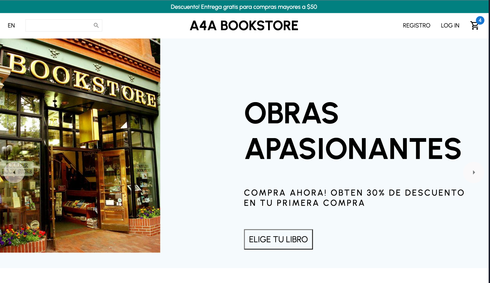
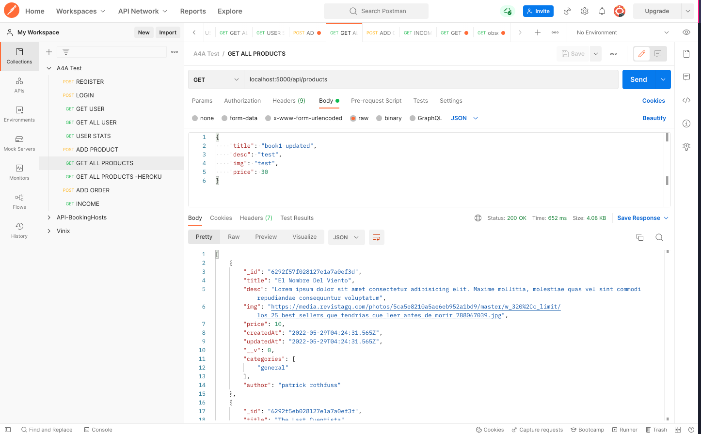
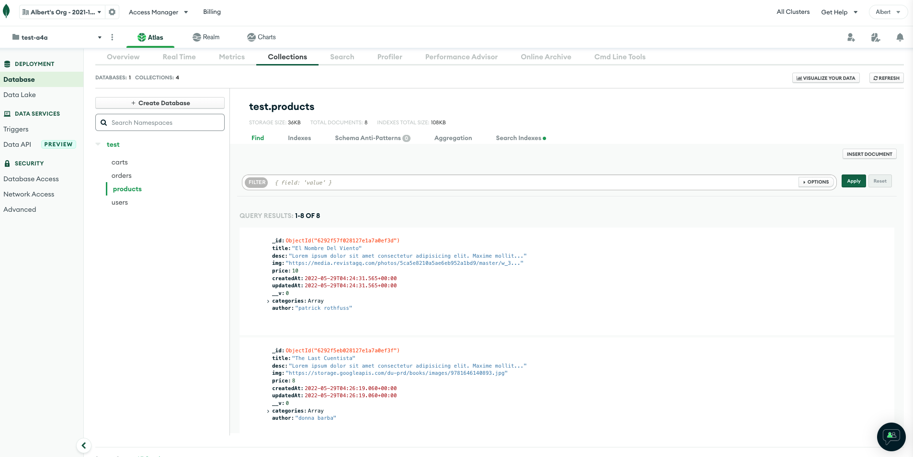
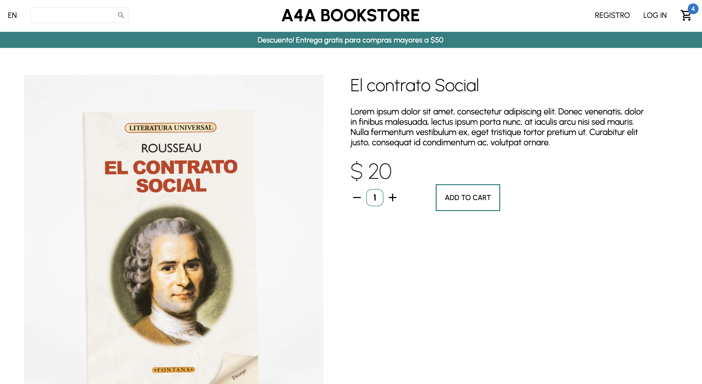
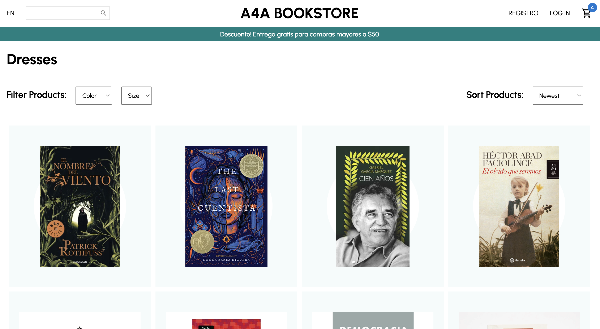
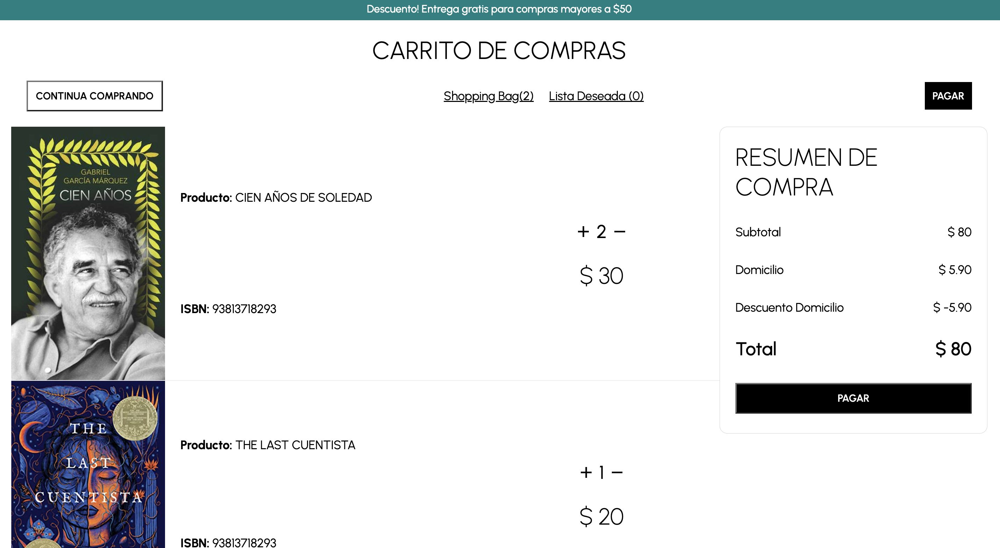

<a href="#">
    
</a>

# Test A4A Bookstore Ecommerce


:star: [Requirement of test](https://groovy-dahlia-91d.notion.site/Frontend-Engineer-9af0a177379e4ff8a7a74d3a84dc4ac9)

This is a sample application that demonstrates an E-commerce website using the React. The application loads products a MongoDB database and displays them. Users can select to display products in a single category. Users can click on any product to get more information including pricing, image, ISBN and description. Users can select items and add them to their shopping cart

[]


## Import Data
I have made a API for this test using NodeJS, saving the database at MongoDB and deployed in Heroku in this [link](https://obscure-anchorage-32277.herokuapp.com/api/). The tests were done using postman




## Live Demonstration

The E-commerce demo can be [viewed online here](https://ecommerce-a4a-test.netlify.app/).

Here are screenshots that show the E-commerce demo application in use.


**Home Page**


---

**Login**


---

**Register**


---

**Product**


---

**ProductList**


---

**Shopping Cart**


## Getting Started
To get started  you can simply clone this `test-a4a` repository and install the dependencies.

Clone the `test-a4a` repository using git:

```bash
git clone git@github.com:alberturo/test-a4a.git
cd test-a4a
```

Install dependencies Frontend with this command:
```bash
npm install
npm i styled-components
npm install @mui/material @emotion/react @emotion/styled
npm i axios
npm install @reduxjs/toolkit
npm install redux-persist

```

Install dependencies Backend with this command:
```bash
npm init -y
npm install express mongoose dotenv nodemon
npm i styled-components
npm install @mui/material @emotion/react @emotion/styled
npm i -g heroku
```

Run the application with this command:
```bash
npm start

```

## Tech Stack
* React
* Node.js
* Express.js

## Code Scalable
* Organization by components and pages
* Responsive reusable
* RequestMethod reusable

## Security
* implementations of standard and secure cryptographic algorithms [CryptoJS](https://www.npmjs.com/package/crypto-js)
* JSON Web Token [JWT](https://www.npmjs.com/package/jsonwebtoken)
* Environment variables .env