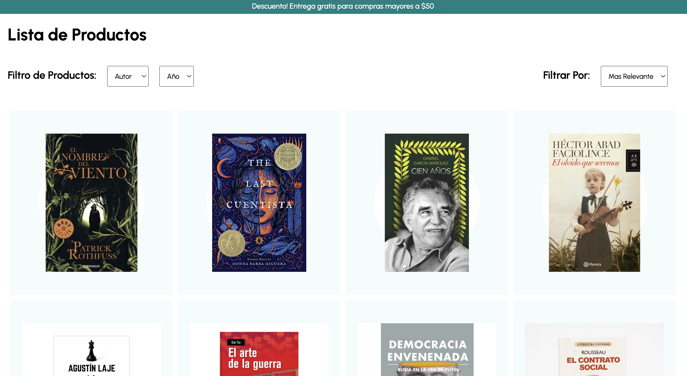

<a href="#">
    
</a>

# Test A4A Bookstore Ecommerce


:star: [Requirement of test](https://groovy-dahlia-91d.notion.site/Frontend-Engineer-9af0a177379e4ff8a7a74d3a84dc4ac9)

This is a sample application that demonstrates an E-commerce website using the React. The application loads products a MongoDB database and displays them. Users can select to display products in a single category. Users can click on any product to get more information including pricing, image, ISBN and description. Users can select items and add them to their shopping cart

[]


## Import Data
I have included a data file in this repo. Inside that file you will find exportation of 3 conts: ```bash export const sliderItems | export const categories | export const popularProducts ``` These 3 conts contain the data in order to mock the img, id, title and bg of the products.

## Live Demonstration

The E-commerce demo can be [viewed online here](#).

Here are screenshots that show the E-commerce demo application in use.


**Home Page**


---

**Login**


---

**Register**


---

**Product**


---

**ProductList**


---

**Shopping Cart**


## Getting Started
To get started  you can simply clone this `test-a4a` repository and install the dependencies.

Clone the `test-a4a` repository using git:

```bash
git clone git@github.com:alberturo/test-a4a.git
cd test-a4a
```

Install dependencies with this command:
```bash
npm install
npm i styled-components
npm install @mui/material @emotion/react @emotion/styled
```

Run the application with this command:
```bash
npm start
```

## Tech Stack
* React
* Node.js
* Express.js

## Code Scalable
* Organization by components and pages
* Responsive reusable
* 